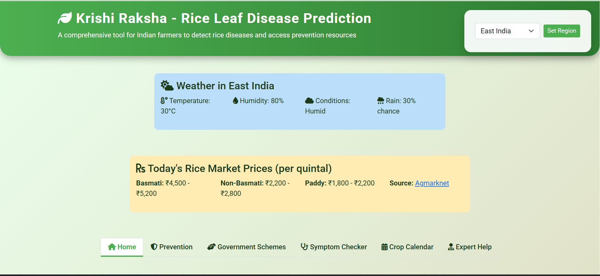
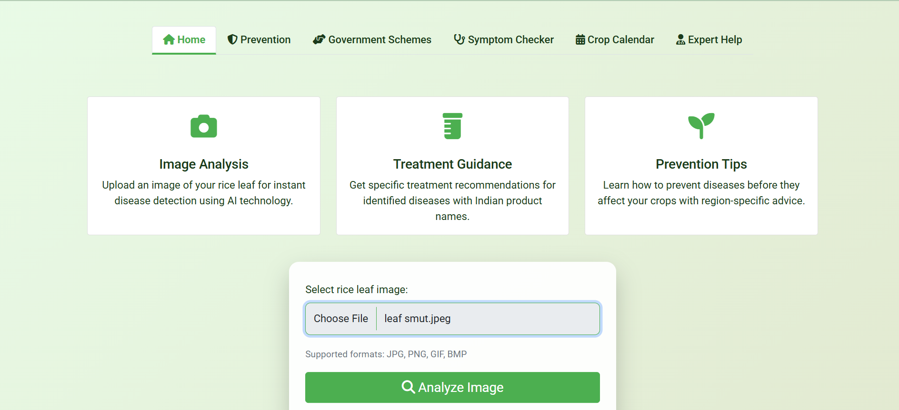
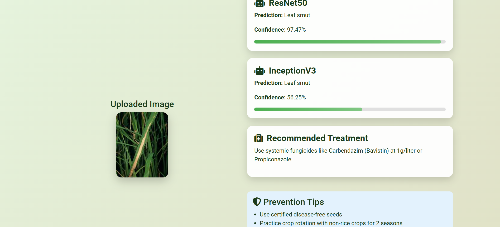
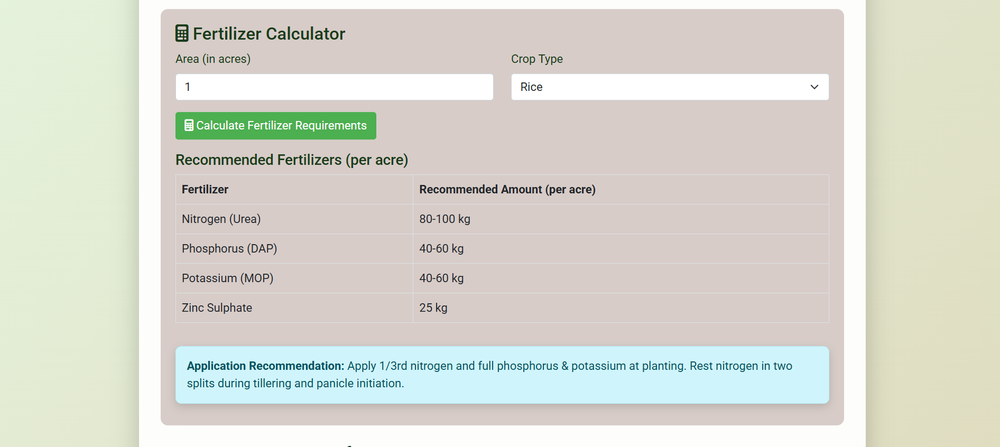
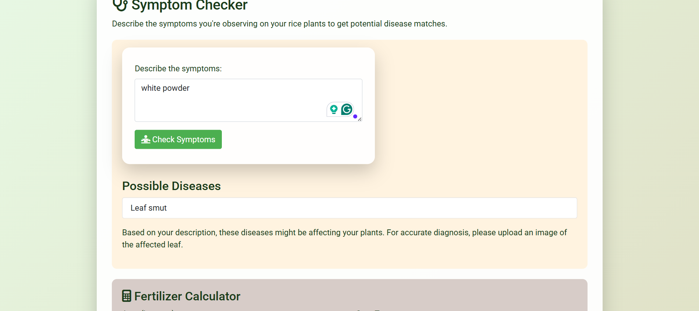

# 🍚 Rice Leaf Disease Prediction System

[](https://www.python.org/) [](https://flask.palletsprojects.com/) [](LICENSE)

A **web-based application** that leverages **deep learning** and **transfer learning** to detect diseases in rice leaves. Built with **Flask**, this system offers a **user-friendly interface** for uploading rice leaf images and receiving **quick diagnostic feedback**.

---

## 🌟 Features

- 🖼️ **Image Upload Interface** – Easily upload rice leaf images through the web app.
- 🧠 **Disease Classification** – Powered by a pre-trained deep learning model using **transfer learning**.
- ⚡ **Fast & Accurate** – Get instant feedback with high accuracy.
- 🌐 **Web App Backend** – Built with Flask for seamless deployment.
- 📊 **Scalable** – Can be extended for multiple plant disease detection.

---

## 🚀 Setup & Installation

### Requirements

- Python **3.6+**
- Flask and other dependencies listed in `requirements.txt`

### Installation Steps

```bash
# Clone the repository
git clone https://github.com/Darshan-gowda-m/RiceLeafDiseaseDetection.git
cd RiceLeafDiseaseDetection

# Install dependencies
pip install -r requirements.txt

# Run the application
python app.py
```

Open your browser and go to: [http://127.0.0.1:5000/](http://127.0.0.1:5000/)

---

## 🖼️ Preview

Sample preview of the website:

<div align="center">
  
</div>

---

## 📂 Project Structure

```
RiceLeafDiseaseDetection/
├─ app.py                 # Flask application
├─ model/                 # Pre-trained model files
├─ static/
│  └─ images/             # Website images
├─ templates/             # HTML templates
├─ requirements.txt       # Python dependencies
└─ README.md
```

---

## 📝 Usage

1. Open the web app in your browser.
2. Upload a rice leaf image.
3. Click **Predict**.
4. Receive instant disease diagnosis with confidence score.

---

## 💡 Future Enhancements

- Mobile app integration.
- Multi-plant disease detection.
- Dashboard for tracking disease trends.

---

## 📄 License

This project is licensed under the [MIT License](LICENSE).

<div align="center">
 
  
  
  
  
</div>

## 🤝 Collaborations are Welcomed
